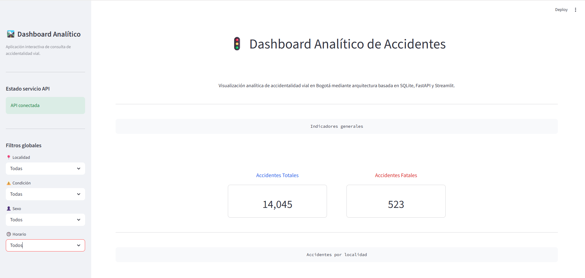
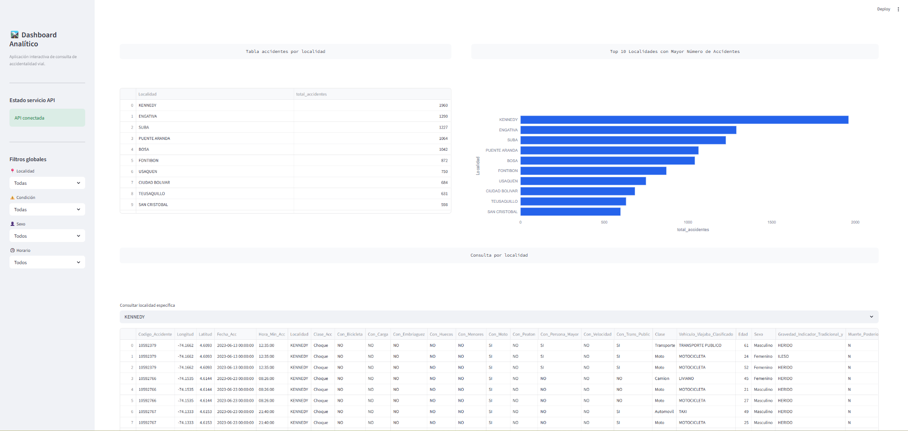
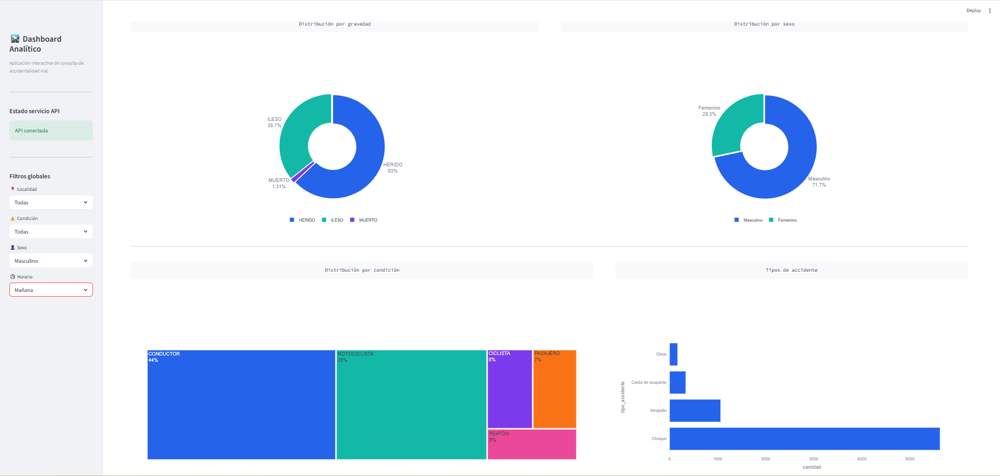

# 🚦 Dashboard Analítico de Accidentes Viales

Proyecto de ingeniería y analítica de datos orientado a la construcción de una arquitectura desacoplada de consulta de datos basada en:

* SQLite
* Python + Pandas
* FastAPI
* Streamlit
* Plotly

El proyecto expone información de accidentalidad vial mediante una API REST analítica y una aplicación frontend interactiva, siguiendo principios de modularidad, separación de responsabilidades y arquitectura cliente-servidor.

La solución implementa un flujo desacoplado:

```text
Streamlit
    ↓ HTTP Requests
FastAPI
    ↓
Services (Pandas)
    ↓
SQLite
```

## Objetivo del proyecto

Construir una arquitectura modular de consulta y exposición de datos analíticos utilizando un dataset estructurado de accidentalidad vial.

El proyecto busca implementar una solución desacoplada basada en una capa de datos SQLite, una capa de servicios desarrollada en Python/Pandas, una API REST construida con FastAPI y una aplicación frontend interactiva desarrollada en Streamlit.

Además del análisis de datos, el proyecto está orientado a fortalecer conceptos de:

* arquitectura cliente-servidor
* diseño de APIs REST
* separación de responsabilidades
* modularidad Python
* desacoplamiento frontend ↔ backend
* visualización analítica interactiva

La arquitectura fue diseñada priorizando:

* reutilización de lógica
* claridad estructural
* mantenibilidad
* escalabilidad para futuras expansiones analíticas e integración con IA.

## Arquitectura del sistema

El proyecto implementa una arquitectura desacoplada basada en separación clara de responsabilidades entre capa de datos, lógica de negocio, API y frontend.

### Flujo arquitectónico

```text
Streamlit (Frontend Dashboard)

        ↓ HTTP Requests

FastAPI (API REST)

        ↓

Services Layer (Python + Pandas)

        ↓

SQLite Database
```

### Responsabilidades por capa

#### SQLite — Capa de datos

Responsable del almacenamiento persistente del dataset estructurado de accidentalidad vial.

---

#### Services — Lógica analítica

Implementa la lógica de negocio y transformación de datos utilizando Python y Pandas.

Responsabilidades:

* carga de datos
* agregaciones analíticas
* filtros dinámicos
* reutilización de consultas
* preparación de datos para consumo API

---

#### FastAPI — Capa API

Expone la información mediante endpoints REST analíticos.

Responsabilidades:

* request/response HTTP
* parametrización mediante query parameters
* integración con services
* validación básica de entradas
* serialización JSON

---

#### Streamlit — Frontend interactivo

Consume exclusivamente la API mediante requests HTTP.

Responsabilidades:

* visualización analítica
* KPIs
* tablas
* gráficos interactivos Plotly
* filtros globales desacoplados
* experiencia de usuario del dashboard


## Stack tecnológico

| Capa           | Tecnología      | Propósito                         |
| -------------- | --------------- | --------------------------------- |
| Datos          | SQLite          | almacenamiento estructurado       |
| Procesamiento  | Python + Pandas | lógica analítica y transformación |
| Backend        | FastAPI         | API REST                          |
| Frontend       | Streamlit       | dashboard interactivo             |
| Visualización  | Plotly          | gráficos analíticos               |
| Comunicación   | HTTP + JSON     | consumo frontend ↔ API            |
| Versionamiento | Git             | control de versiones              |

---

## Estructura del proyecto

```text
project_03_base_api_streamlit/

│
├── data/
│   │
│   ├── processed/
│   │   └── accidentes_bogota_2023_dataset_limpio.csv
│   │
│   └── raw/
│       └── accidents.db
│
├── src/
│   │
│   ├── api/
│   │   └── main.py
│   │
│   ├── database/
│   │   ├── connection.py
│   │   └── load.py
│   │
│   └── services/
│       └── accident_service.py
│
├── app/
│   │
│   ├── main.py
│   │
│   ├── components/
│   │   ├── header.py
│   │   ├── sidebar.py
│   │   ├── kpis.py
│   │   ├── charts.py
│   │   ├── tables.py
│   │   └── common.py
│   │
│   └── utils/
│       ├── api_client.py
│       └── theme.py
│
├── requirements.txt
│
└── README.md
```

### Organización modular

#### `data/`

Contiene los activos de datos del proyecto.

* `raw/` → almacenamiento de base de datos SQLite.
* `processed/` → dataset procesado proveniente del pipeline ETL previo.

---

#### `src/database/`

Gestiona acceso y carga de datos.

Responsabilidades:

* conexión SQLite
* carga de datos
* abstracción de acceso a la capa de datos

---

#### `src/services/`

Implementa la lógica analítica reutilizable desacoplada de la API.

Responsabilidades:

* filtros dinámicos
* agregaciones analíticas
* preparación de datos
* consultas reutilizables

---

#### `src/api/`

Expone los endpoints REST y administra la interacción HTTP.

---

#### `app/components/`

Contiene componentes visuales reutilizables del dashboard Streamlit.

---

#### `app/utils/`

Centraliza helpers frontend, cliente HTTP y configuración visual compartida.

## Funcionalidades implementadas

### Capa de datos

Implementación de base de datos SQLite integrada a una arquitectura de consulta analítica.

Capacidades:

* almacenamiento estructurado de datos
* integración con dataset procesado proveniente del pipeline ETL
* acceso desacoplado mediante capa `database`

---

### Capa services

Implementación de lógica analítica reusable utilizando Python y Pandas.

Funciones desarrolladas:

* `load_accidents_data()`
* `apply_filters()`
* `get_total_accidents()`
* `get_total_fatal_accidents()`
* `get_accidents_by_locality()`
* `filter_accidents_by_locality()`
* `get_accidents_by_severity()`
* `get_accidents_by_condition()`
* `get_accidents_by_accident_type()`
* `get_accidents_by_sex()`

Capacidades implementadas:

* agregaciones analíticas
* filtros dinámicos desacoplados
* reutilización de lógica
* propagación de filtros frontend → API → services
* preparación de datos para consumo API

---

### API REST — FastAPI

Endpoints analíticos implementados:

| Método | Endpoint                          |
| ------ | --------------------------------- |
| GET    | `/`                               |
| GET    | `/health`                         |
| GET    | `/accidents/total`                |
| GET    | `/accidents/fatal`                |
| GET    | `/accidents/by-locality`          |
| GET    | `/accidents/locality/{localidad}` |
| GET    | `/accidents/by-severity`          |
| GET    | `/accidents/by-condition`         |
| GET    | `/accidents/by-accident-type`     |
| GET    | `/accidents/by-sex`               |

Capacidades implementadas:

* arquitectura REST
* endpoints analíticos
* query parameters opcionales
* filtros HTTP dinámicos
* serialización JSON
* integración API → services

---

### Frontend — Streamlit Dashboard

Dashboard interactivo consumiendo exclusivamente la API REST.

Capacidades implementadas:

* KPIs generales
* filtros globales
* consulta por localidad
* tablas analíticas
* visualizaciones Plotly reutilizables
* manejo frontend de errores
* renderizado modular desacoplado

Visualizaciones implementadas:

* gráficos de barras
* donut charts
* treemap charts
* tablas dinámicas
* métricas analíticas

Arquitectura frontend:

```text id="7d5pwx"
main.py

↓ orquestación

components/

↓ renderizado visual

utils/

↓ helpers + cliente API + theme
```

## Instalación

### 1. Clonar repositorio

```bash
git clone <URL_DEL_REPOSITORIO>

cd project_03_base_api_streamlit
```

---

### 2. Crear entorno virtual

```bash
python -m venv venv
```

---

### 3. Activar entorno virtual

#### Windows

```bash
venv\Scripts\activate
```

#### Linux / MacOS

```bash
source venv/bin/activate
```

---

### 4. Instalar dependencias

```bash
pip install -r requirements.txt
```

---

### 5. Cargar dataset y crear base de datos SQLite

Antes de ejecutar la API o el dashboard, es necesario inicializar la base de datos del proyecto.

Ejecuta el archivo:

```bash
python src/database/load.py
```

Este script utiliza el dataset procesado ubicado en:

```text
data/processed/accidentes_bogota_2023_dataset_limpio.csv
```

Durante la ejecución, el script:

1. lee el archivo CSV procesado
2. establece conexión con SQLite mediante `get_connection()`
3. crea automáticamente `accidents.db` si aún no existe
4. crea/reemplaza la tabla `accidents`
5. carga los datos utilizando `pandas.to_sql()`

Una vez completado este paso, la base de datos queda lista para ser consumida por FastAPI y Streamlit.


---

## Ejecución del proyecto

### Ejecutar API FastAPI

Desde la raíz del proyecto:

```bash
uvicorn src.api.main:app --reload
```

API disponible en:

```text
http://127.0.0.1:8000
```

Swagger UI:

```text
http://127.0.0.1:8000/docs
```

---

### Ejecutar Dashboard Streamlit

Desde la raíz del proyecto:

```bash
streamlit run app/main.py
```

Aplicación disponible en:

```text
http://localhost:8501
```


## Dashboard — Vista general

### KPIs y métricas generales

Visualización de indicadores principales de accidentalidad vial.

* accidentes totales
* accidentes fatales
* métricas dinámicas mediante filtros globales



---

### Análisis por localidad

Consulta analítica desacoplada mediante API REST.

Visualizaciones implementadas:

* tabla analítica
* top localidades con mayor accidentalidad
* consulta individual por localidad



---

### Distribuciones analíticas

Visualizaciones interactivas construidas con Plotly.

Incluye:

* distribución por gravedad
* distribución por sexo
* condición del actor vial
* tipos de accidente



## Aprendizajes técnicos

Durante el desarrollo del proyecto se fortalecieron conceptos de ingeniería de datos, backend y desarrollo de aplicaciones analíticas.

Conceptos trabajados:

### Arquitectura y backend

* arquitectura cliente-servidor
* APIs REST
* request / response HTTP
* endpoints dinámicos
* query parameters
* serialización JSON
* status codes HTTP
* Swagger UI
* separación frontend ↔ backend

---

### Python y modularidad

* modularidad Python
* paquetes y módulos
* imports absolutos
* ejecución modular
* reutilización de lógica
* separación de responsabilidades

---

### Datos y procesamiento

* SQLite
* integración base de datos ↔ Pandas
* consultas tabulares
* agregaciones analíticas
* filtros dinámicos
* transformación de datos

---

### Frontend analítico

* consumo HTTP desde Streamlit
* layouts interactivos
* renderizado desacoplado
* manejo frontend de errores
* visualización analítica con Plotly
* componentes reutilizables

---

### Buenas prácticas de desarrollo

* entorno virtual (`venv`)
* gestión de dependencias
* Git y control de versiones
* arquitectura modular
* legibilidad y mantenibilidad de código

## Mejoras futuras

El proyecto fue diseñado con una arquitectura modular orientada a facilitar futuras expansiones funcionales y analíticas.

Posibles mejoras contempladas:

### Analítica y datos

* módulo temporal independiente para análisis por fecha y hora
* nuevas métricas e indicadores analíticos
* ampliación de consultas y agregaciones
* enriquecimiento del modelo analítico

---

### Frontend y experiencia de usuario

* refinamiento UI/UX del dashboard
* mejoras visuales adicionales en Plotly
* optimización responsive del layout
* incorporación de nuevas visualizaciones interactivas

---

### Infraestructura y despliegue

* deploy de API y dashboard
* configuración cloud deployment
* containerización futura mediante Docker

---

### Integración IA y agentes

Futura expansión del proyecto hacia arquitecturas orientadas a IA aplicada a datos estructurados.

Tecnologías contempladas:

* LangChain
* LangGraph
* agentes analíticos
* consultas inteligentes sobre datos tabulares


---

Proyecto desarrollado por :

José Luis Mena Palomeque

LinkedIn:

www.linkedin.com/in/josé-luis-mena-42279a26b


GitHub:

https://github.com/Josemena95/data-portfolio.git